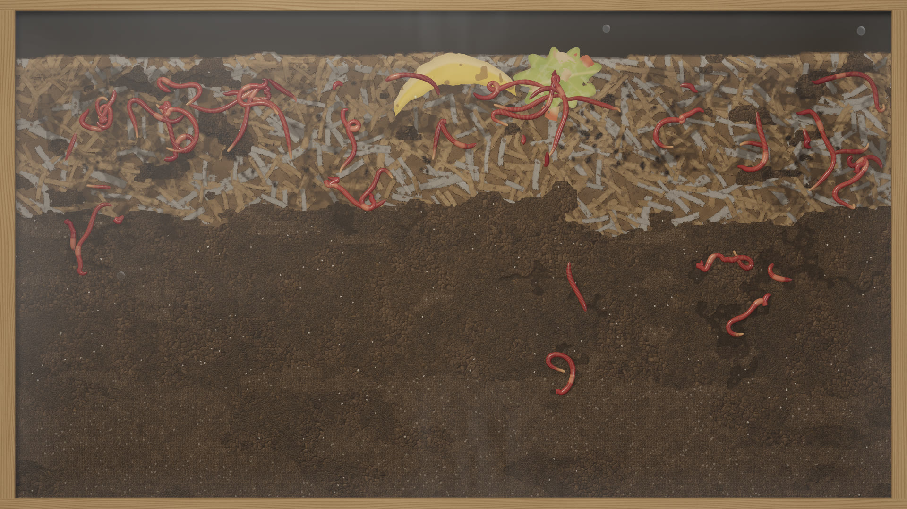

# Shadow Worm Farm

A photorealistic, full-screen, glass-sided worm bin for Linux, made to run unattended for a day or more on a
stream. Around a hundred red wigglers live in shredded bedding over dark compost. They smell rotting kitchen
scraps and gather on them in knots to feed. They leave castings and burrows along the glass and lay cocoons that
hatch into pale young worms. Each worm decides for itself from what it senses where it is. Nothing is scripted.



- **Native Linux.** Built with Godot 4.7.2-stable (pinned) and a C++ GDExtension. Runs offline and needs no editor.
- **A fresh bin every launch.** Each launch draws a new seed from the operating system; `--seed N` reproduces a
  bin exactly and `--resume` continues the newest checkpoint.
- **90–150 soft-bodied worms**, each a smooth curve through 24 body points. They have segment grooves, the swollen
  clitellum on adults, peristaltic waves as they crawl, a wet sheen, and bodies that flatten where they press
  against the pane.
- **A living bin.** Scraps (banana peel, apple core, lettuce, carrot peelings, coffee grounds, eggshell) rot,
  brown and grow mould, and their smell spreads through the substrate. Hungry worms follow it. Scraps are eaten
  away, castings darken the bedding and fade back in, burrows along the glass slowly fill in, and cocoons hatch.
  The population levels off by itself.
- **The keeper's two jobs:** food every four hours and a misting when the top dries out. Both happen on their own,
  and *Feed now* / *Mist now* (F5 / F6) do them on demand. Misting fogs the glass with condensation that clears
  over the following minutes.
- **Procedural 48 kHz stereo sound** made from simulation events: bedding crackle as worms crawl against the
  glass, soft wet feeding sounds, scraps landing, the spray bottle and droplets. It is voice- and rate-limited and
  uses no recorded samples.
- **Goes live by itself.** Built-in streaming to YouTube, X or any RTMP server, from the bin's own picture and
  sound (no screen capture). Set the key once; then *Resume and go live* (or `--live`) starts and reconnects on its
  own. With YouTube's Auto-start it's fully hands-off.
- **Stream-safe.** The capture image is clean: no cursor or overlays, and no error pop-ups. The window identity is
  stable, the app keeps running when unfocused, and the screen is kept awake. It never touches the camera or
  microphone. A separate operator window guards the new-bin and quit actions.
- **Long-run safe.** Atomic, versioned, checksummed checkpoints every 10 minutes. Memory and disk use are bounded,
  and logs rotate.

## Install (per user, no root)

From a release: download `shadow-worm-farm-<version>-linux-x86_64.tar.gz` from
[Releases](https://github.com/Shadowfetchapps/shadow-worm-farm/releases), extract it and run
`tools/install.sh` inside the extracted folder.

From source:

```bash
git clone --recursive https://github.com/Shadowfetchapps/shadow-worm-farm.git
cd shadow-worm-farm
GODOT=/path/to/Godot_v4.7.2-stable_linux.x86_64 tools/build.sh
tools/install.sh
```

The build needs CMake ≥ 3.25, a C++20 compiler, and Godot 4.7.2-stable with its export templates. The install
puts the program in `~/.local/opt/shadow-worm-farm`, the launcher in `~/.local/bin/shadow-worm-farm`, and a
desktop entry and icon under `~/.local/share`. Bins, settings and logs live in `~/.local/share/shadow-worm-farm`.
`tools/uninstall.sh` removes the program but keeps your bins. Live streaming needs `ffmpeg` and `secret-tool`
(`sudo apt install ffmpeg libsecret-tools`).

## Run

```bash
shadow-worm-farm                 # a new bin, full screen
shadow-worm-farm --resume        # continue the newest checkpoint
shadow-worm-farm --resume --live # continue and go live to the saved destination
```

**F2** shows or hides the operator window, **F5** feeds, **F6** mists, **F11** toggles full screen. See
[docs/OPERATING.md](docs/OPERATING.md) for every option, the operator window, going live, checkpoints and
troubleshooting.

## Documentation

- [Operating guide](docs/OPERATING.md): running it on stream, going live, controls, checkpoints, inspection tools
- [Stream description](docs/STREAM.md): ready-to-paste title and text for the stream page
- [How the bin works](docs/DESIGN.md): the simulation model, the rendering and the sound
- [Test report](docs/TESTING.md): what is tested, how, and the latest results
- [Assets and licences](docs/ASSETS.md): provenance of every asset and third-party component

## Repository layout

| Path | What |
|---|---|
| `core/` | Deterministic bin simulation in plain C++ (no engine dependency) |
| `extension/` | GDExtension: the simulation, worm-body and substrate buffers, procedural audio, live streaming |
| `game/` | Godot project: presentation, shaders, operator window, checkpoints, command line |
| `tests/` | Core test suite (`wormfarm_tests`) |
| `tools/` | `wormfarm_sim` (headless accelerated runs and maps), build and install scripts |
| `third_party/godot-cpp` | godot-cpp 10.0.0-stable (submodule) |

## Licence

MIT. See [LICENSE](LICENSE). Third-party components and their licences are listed in [docs/ASSETS.md](docs/ASSETS.md).
