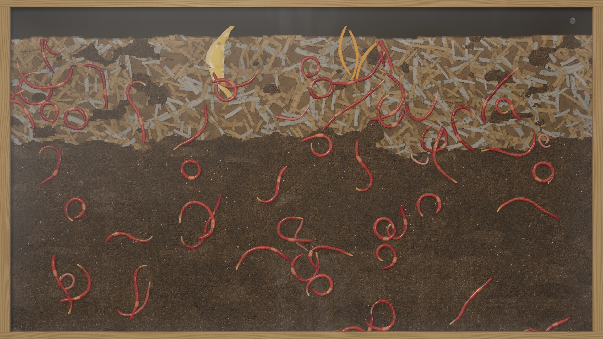
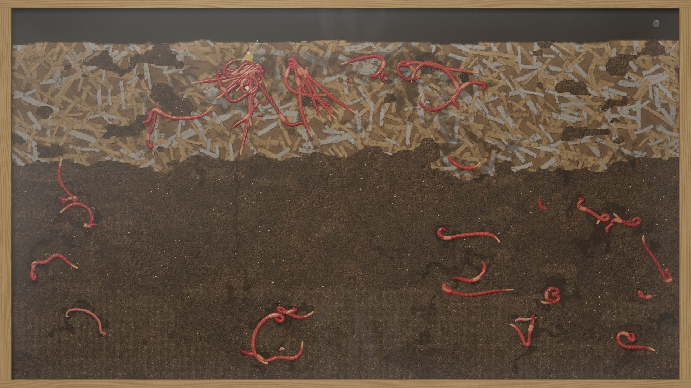
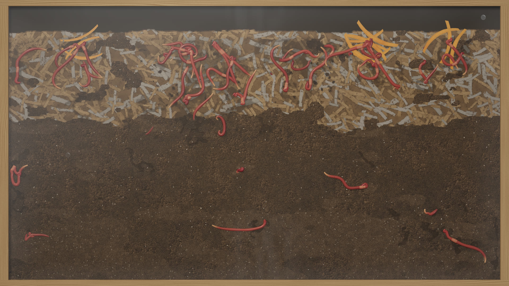
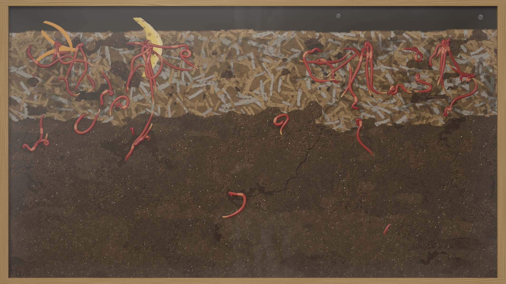
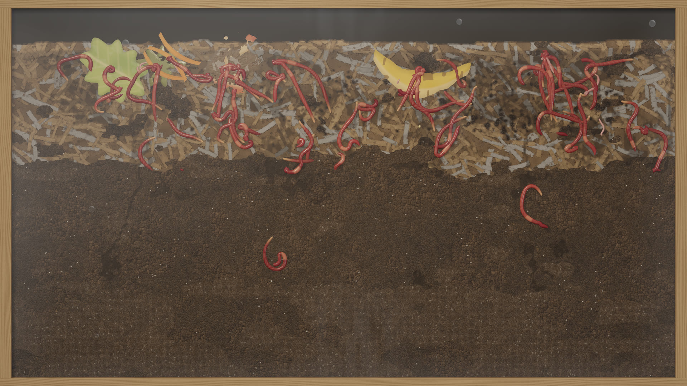
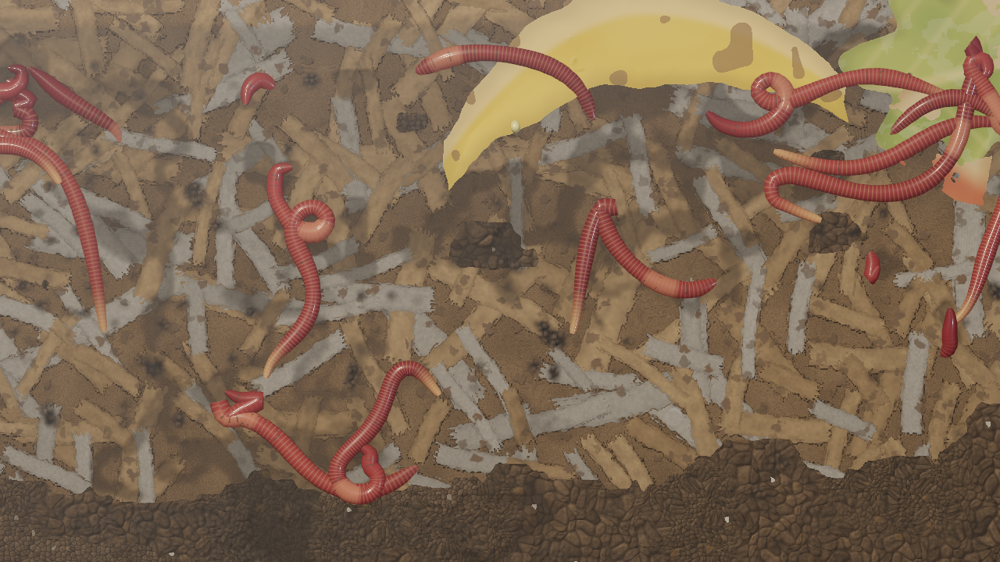

# Test report

Machine: AMD Ryzen 7 5700G, NVIDIA GeForce RTX 5060 Ti, Pop!_OS with the COSMIC desktop, Godot 4.7.2-stable.
Date: 2026-09-24. Shadow Ant Farm was streaming live on the same machine throughout, so the GPU and encoder were
shared during every measurement below.

## Summary

| Area | How it is tested | Result |
|---|---|---|
| Fresh seeds | `fresh_seeds`: 5 seeds give 5 distinct bins and population sizes. Through the extension, two launches draw different OS seeds, both below 2⁶³ so they survive Godot's signed integers | Pass |
| Determinism | `determinism`: same seed, same state hash after 15 simulated minutes; different seed differs | Pass |
| Frame independence | `frame_independence`: 1-tick, varied and 60-tick batches give the same state | Pass |
| Worms stay in the bin | `worms_stay_in_the_bin`: every tick for 20 simulated minutes, every head is in the substrate under the surface, every body point is inside the panes, depth is in range, and body segments never stretch | Pass (worst stretch ×1.00) |
| Movement and visibility | `movement_and_visibility`: over a simulated hour most worms travel, and a sensible share is at the glass | Pass (107 of 111 moved; 35% at the glass on average) |
| Feeding and castings | `feeding_and_castings`: *Feed now* adds scraps, worms gather and eat, castings build up; *Mist now* wets the top and raises the humidity | Pass (up to 40 worms feeding at once) |
| Life cycle | `life_cycle`: with an accelerated life cycle, cocoons are laid, hatch and the young grow | Pass |
| Population bound | `population_is_bounded`: with 50× the laying rate, the population never exceeds the cap | Pass (178, cap 200) |
| Persistence | `persistence`: checkpoint, restore, continue for 30 minutes, same state hash. Corrupted, truncated and empty files are rejected. The installed launcher saves on quit and resumes with `--resume` | Pass |
| Configuration | `config_round_trip`: dump → set reproduces the configuration exactly | Pass |
| 24-hour pacing | `pacing_24h`: two seeds, 24 simulated hours each | Pass (see below) |
| Long run | `wormfarm_sim`, 72 simulated hours | Castings and population level off (see below) |
| Headless mode | `--headless-test 2` through the extension and the exported binary. It covers determinism, resume, fresh seeds, buffer sizes, feeding and the audio range | Pass |
| Audio | `game/tests/render_audio.gd`: 2 minutes rendered offline from a live simulation | Peak −23.4 dBFS, RMS −36.8 dBFS, nothing rate-limited |
| Frame times | `--bench 20` | 60.0 fps locked in a window. At 3840 × 2160 offscreen, uncapped: mean 10.0 ms (99.8 fps), p99 10.4 ms |
| Live streaming | Local RTMP server: picture, sound, sync, frame rate | Pass (see below) |
| Real-time 24-hour soak | `--soak 24` | **Not run.** It needs 24 real hours. |

Run the core suite with `build/wormfarm_tests`. It takes about 10 minutes, most of it the two 24-hour pacing
runs; set `WORMFARM_PACING_SEEDS=1` for a quicker pass.

## 24-hour pacing (accelerated, same core)

| Seed | Worms at 24 h | Hatched | Feedings | Mists | Feeding (avg) | Resting (avg) | At the glass (avg) | Most scraps at once | Eaten (handfuls) |
|---|---|---|---|---|---|---|---|---|---|
| `5eed0000` | 108 (12 young) | 12 | 6 | 7 | 18.5 | 29.4 | 34.1 | 10 | 8.0 |
| `5eed1eef` | 155 (10 young) | 10 | 6 | 7 | 31.4 | 42.5 | 50.5 | 7 | 12.1 |

These are checked every 5 simulated minutes: at most 16 scraps in the bin, the population cap, and no growth in
simulation memory. At 24 h the checks are: exactly 6 feedings, an average of more than 8 worms feeding, more than
5 handfuls eaten, and at least one hatching.

## Long run (72 simulated hours)

`wormfarm_sim --seed 0x5eed0001 --hours 72`:

| Hour | 0 | 12 | 24 | 36 | 48 | 60 | 72 |
|---|---|---|---|---|---|---|---|
| Worms | 134 | 134 | 143 | 145 | 154 | 156 | 157 |
| Castings (sum of levels) | 8,402 | 9,319 | 9,676 | 9,864 | 10,021 | 10,137 | 10,260 |

Castings rise quickly while the first scraps are processed, then level off as fresh castings mix back into the
substrate: +917 in the first 12 hours, +157 from hour 36 to 48, +123 from hour 60 to 72. The population grows slowly towards the cap and
laying slows as it approaches. The simulation's memory footprint is constant (0.4 to 0.5 MB).

## Visual inspection

Stills rendered at 3840 × 2160 with `--seed 0x5eed0001 --capture … --capture-hours 0,1,4,8,12,24`, in
`docs/images/` (scaled to 1920 px, plus a 1:1 crop):

| 0 h | 1 h | 4 h |
|---|---|---|
|  |  |  |
| **8 h** | **12 h** | **24 h** |
|  |  |  |

Close-up at 1:1 (12 h): 

What was checked, and fixed where needed, during development:

- **No grid artefacts.** The substrate is sampled bicubically. A faint grid in the bedding came from
  screen-space derivatives taken inside divergent branches; they are now taken once, in uniform control flow.
- **Organic material boundaries**, with no staircase.
- **Bedding looks like soaked, torn cardboard and newsprint with compost crumbs**, not sticks. Compost reads as
  irregular rounded crumbs, not a mosaic.
- **Worms are curved from the first frame.** New worms are laid out along a curving path; they used to spawn as
  straight sticks.
- **Worms meander.** Feeding worms curl about the scrap, forming knots rather than a stiff starburst.
- **Worms spread through the depth.** Each worm has a preferred depth, so the lower compost isn't empty while food
  is out.
- **Burrows read as channels along the glass,** not blotches covering the pane.
- **Condensation is subtle,** with no speckle noise.
- **Scraps are life-size.** A banana peel is about a quarter of the bin's width.

## Live streaming (local RTMP server)

Tested against `ffmpeg -listen 1 -i rtmp://127.0.0.1:PORT/live/k -c copy out.flv`, never against a public
service:

- **Development build, 45 s:** H.264 1280 × 720 and AAC 48 kHz arrived; 1,280 video frames in 42.65 s = 30.0
  fps, no gaps. The last audio and video timestamps are 9 ms apart. The picture is the bin (checked frame at
  30 s), with no black frames.
- **Installed launcher** (`shadow-worm-farm --windowed --operator --live-url … --run-seconds 30`): live within 2 s
  of starting; the stream received 27.7 s. It saved a checkpoint on quit, and `--resume` continued it. Audio mean
  −36.0 dB, peak −23.1 dB.
- The streaming code is the same as Shadow Ant Farm 1.1.0's (reconnection, refused-server handling, keyring,
  redaction); see that project's test report. Keys are stored under their own keyring attribute
  (`application shadow-worm-farm`).

Not tested against YouTube or X themselves, which needs your key.

## Real-time 24-hour soak

Not run. `shadow-worm-farm --soak 24` runs it and writes its evidence to `~/.local/share/shadow-worm-farm/soak/`.
Nothing in this report claims a 24-hour soak passed.
